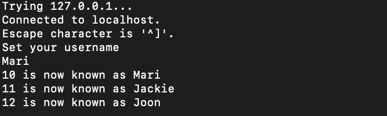
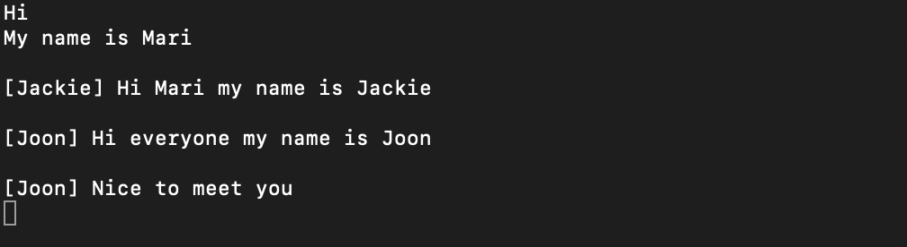
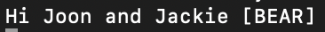
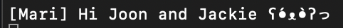

# APELLATUM: Terminal-based Chat With Emojis
Jackie Zeng, Joon Kang, Mari Kang

## Goal of the Project
The goal of this project is to create a chatting application using the TCP protocol in the C language. In addition to standard chatting methods, we will implement text type emojis into the system for them to be sent to other people who are on the same system. We are planning to base the application on a terminal, but if we have time left over we will create a GUI for better user experience of the application. As mentioned above, the chat application is going to be based on the TCP protocol, which means that it only allows local network connections.For this problem, we will implement IP configurations for the users that would allow the connection to a host computer to chat to.

Minimum viable product of our proejct is to implement a system where two users can talk to each other in an unrefined fashion. If this is successful, we will move onto more users participating in the chat and have some kind of a cleaned interface that allows the users to understand what state of the application they are in. If we are successful in implementing a full on text based chatting application, then we will move onto creating a GUI for housing the system that would allow users to interact with the software with ease.

## Learning Goals
- Learn about computer networking in general
- Learn about how sockets works
- Gain experience researching a field we don’t know much about
- Get better at C
- Learn how to use threads for multiple clients


## Code Implementation

### Client Struct

We implemented the username using client struct so that the each client's information including name, identifier, remote address, and file descriptor can be stored in one place. This will let us create multiple threads that is based on the client id, which will allow simultaneous connections and message sending. 
```
/* Client structure */
typedef struct {
    struct sockaddr_in addr;    /* Client remote address */
    int connect_f;              /* Connection file descriptor */
    int user_id;                /* Client unique identifier */
    char name[32];              /* Client name */
} client;
```

### Chat Implementation

We need to first create threads to each individual client that accesses the program using telnet. In the while loop that constantly runs, we accept any incoming connections and create a connect_f variable. When a user connects, we create new values for their user id and its corresponding thread by the add_user function which allows it to run on a separate thread, allowing multiple users to send and recieve messages simultaneously. 
```
	while(1){
        connect_f = accept(listener_d, (struct sockaddr*)&cli_addr, &address_size);
        if (connect_f == -1)
            error("Cannot Open Secondary Socket");

        client *cli = (client *)malloc(sizeof(client));
        cli->addr = cli_addr;
        cli->connect_f = connect_f;
        cli->user_id = user_id++;
        sprintf(cli->name, "%d", cli->user_id);

        /* Add client to the queue*/
        add_user(cli);
        pthread_create(&tid, NULL, &client_handle, (void*)cli);

    }
```

There are two main parts in the chat implementation of this program. Because we have divided the clients to different threads and they run in different processes, it is important to invoke a send message to the clients when one client sends a message. The function we use to achieve this is shown below in the send_message function. 

```
void send_message(char *s, int user_id){
    pthread_mutex_lock(&clients_mutex);
    for (int i = 0; i < MAX_CLIENTS; ++i) {
        if (clients[i]) {
            if (clients[i]->user_id != user_id) {
                if (write(clients[i]->connect_f, s, strlen(s)) < 0) {
                    perror("Write to descriptor failed");
                    break;
                }
            }
        }
    }
    pthread_mutex_unlock(&clients_mutex);
}
```

As it can be seen above, the send message function take two parameters, the pointer to the variable s, which is the message that the client has sent and user_id, which is the client's username. We use this and create a mutex lock, check the number of clients and write to each client's terminal using the write function.


### Emoji Implementation

The emojis are handled in client_handle function. The clients write emoji with brackets([]) like [BEAR], so we can check if the message contains an emoji by finding the bracket within the message. Then, we tokenize the message if there are emojis. Using the tokenized string, we update the emoji_name and update the emoji with the real emoji using get_emoji and replaceword function.

```
for (int i = 0; str_tokens[i][0] != '\0'; i++ ) {
    strcpy(emoji_name, "[");
    strcat(emoji_name, str_tokens[i]);
    strcat(emoji_name, "]");

    strcpy(emoji, get_emoji(str_tokens[i]));
    strcpy(input, replaceWord(input, emoji_name, emoji));
}
```

In get_emoji function, there are several if statements that check if the emoji exists in a input string using strstr. And if the emoji exists, it assigns the emoji to the emoji variable. Else, the emoji variable is set to empty string.

```
char *emoji;
if(strstr(flag, "BEAR") != NULL){
    emoji = "ʕ•́ᴥ•̀ʔっ";
}
```
And the replaceWord function replaces the emoji written in a bracket to the actual emoji. This conversion of string is done in the client handeling function, and it is an automatic process that checks through every message sent and replaces the values if nessesary. 


## Outcome
We were able to create a multi-client group chat in terminal with IP connection using TELNET that has emoji implementation. This is what we can see when we run the Apellatum.c code.


The introduction of the chat application includes the IP address of the host so that anyone within same wireless network can join using the address. 

When a client connects with this IP address, the client can first set their username, and all the clients can know that a new client has joined because they get the message in a format of "... is now joined as (username)". Below is the image when a client first connects to the server and we can see two other clients has joined the chat and the usernames of the new clients.



After setting a username, the clients can send the message. The client's own username is not shown, but the input messages from other clients have username at the front. The clients can also send multiple message at once because each client has thread of its own and the order of sending message doesn't matter.



Emojis are sent using brackets([]). There are three types of Emoji, [BEAR], [WHAT] and [HUH], each replaced with different emoji. For example, if we send



The other clients will get,



The chat ends when the server ends the chat using Ctrl+C. 


## Design Decision
The first design decision we made in the beginning of the project was using TELNET. The two options we had to implement the chat application was HTTP and TELNET/TCP, and we decided to go with TCP/IP connection after researching them because it seemed more valid compared to the other methods of connections when we are implementing in C.

Another major design deicison was to change from server-client chat to client-client chat in the process of implementation. At first, we wrote a chat application that server and client talk to each other. It worked in a way that when client joins the chat, the server that hosted the chat talk with the client within the terminal that they hosted. This worked with a single client, but we decided to change to client-client chat system because it was difficult to implement a chat application with more than two users when server was joining the chat. Now, the host can open another terminal and connect to the chat using the IP address as a client in order to chat with other clients so that each of the participant's information such as username can be store in struct.

The username option was also an important design decision we made after implementing the minimum viable product. We wanted each client to have set their own username, and include the username variable in the client struct. If multiple users join the chat, it is hard to recognize who sent the chat, so we decided to use client struct and store username there so that if a client sends a message, other clients can see the username and the context of the chat. 


## Reflection / Takeaways / Extensions
We acheived our minimum viable product of implementing a terminal-based chat of two users talking to each other. We also reached our strectched goal of adding more than two users to have a group chat. We couldn't make a cleaned interface that looks more like a chatting application, but having username helped the system look more like a chat with multiple people. Also, we could implement the emoji and learned how to replace certain text into emoji, and created separate functions for getting emoji and replacing the string so that we can use it to make more emoji or other features that requires text replacement.

Through this project, we learned how the socket works in Telnet and how the messages can be sent to clients and how the computer networking works in general. Character pointers and passing pointer variable was still confusing, but we could understand more about pointers by debugging the errors we had. The key takeaway from this project is that we learned how to use multithreading in c because concurrent execution is one of the most important factor when implementing chat application and we didn't know how to use multithread in c before working on this project. 

For future extension, we want to work more on dealing with multi-clients sending the message at the same time. Currently, if there's an incoming message while a client is typing a message, the message that a client was typing is interrupted by the incoming message so the terminal looks messy. Although it will be sent correctly to other users, we want to fix it so that the client's incomplete message is not interrupted. Moreover, we want to make a better interface of terminal so that it looks more like a real chat application.

## Resources
The following links are the resources we used for our project. 

- [SoftSys Server Client Update](https://github.com/shrutiyer/SoftSysServerClient/blob/master/reports/report.md)
- [SoftSys Questing Quail](https://matthewruehle.github.io/SoftSysQuestingQuail/)
- [Minimal Text Based Chat](https://rosettacode.org/wiki/Chat_server#C)
- [Multithread Chat in C](https://github.com/eugeneli/Multithreaded-Chat-in-C/blob/master/server.c)